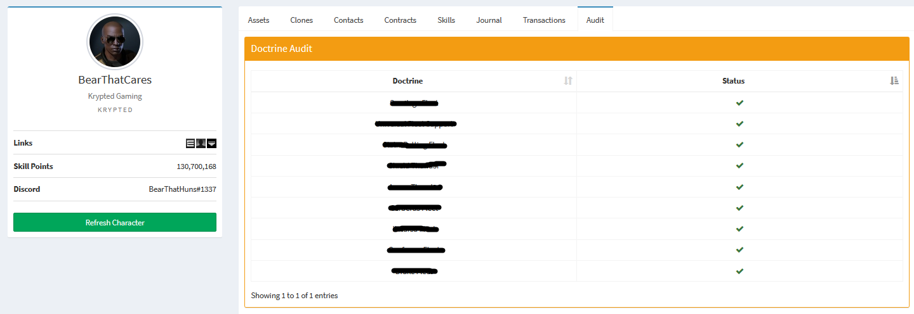

# Features
## Group Rules 
Add users to groups based on characters, corporations, alliances, and even corporation roles. Not amazingly useful by itself, but when paired with `django-discord-connector`, you'll have a fully automated authentication!

## Character Tracking
Track character data for members within your organization. Useful for audits, insights, and administration.

## Corporation Tracking
Track corporation rosters, structures, and more. Useful for roster management and alliance administration. 

## Third Party Extensions

Extend the EVE Connector with other useful packages, like doctrine and fitting audits.

